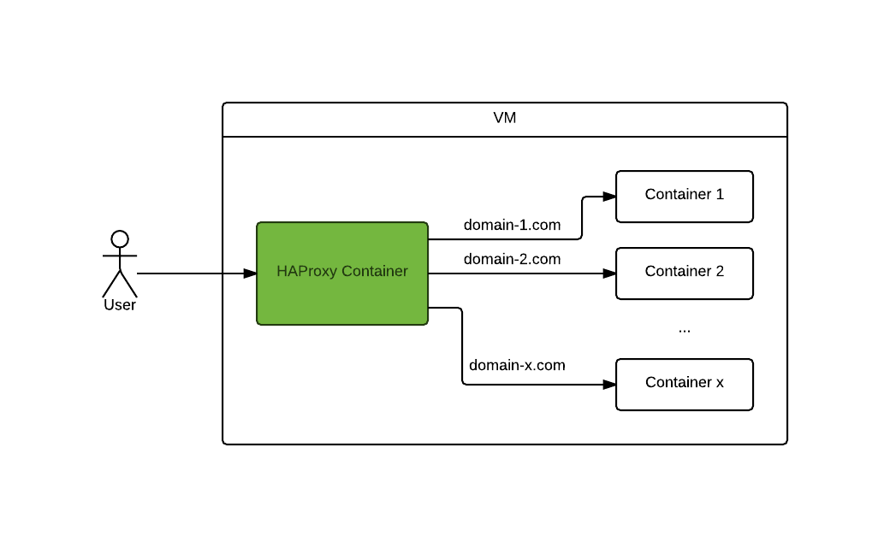
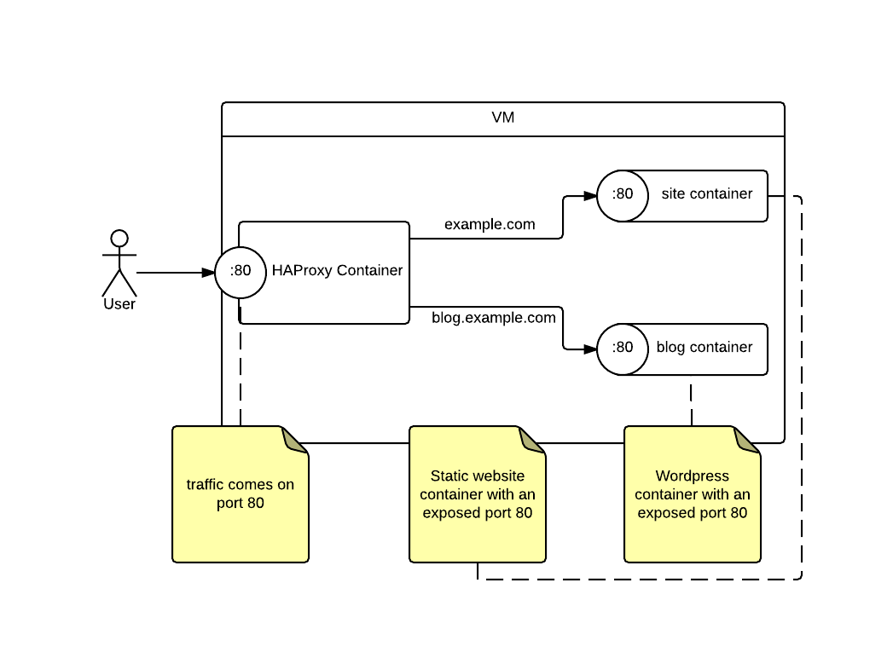

# HAProxy Domain Routing Docker Container

This repository contains Dockerfile of [Haproxy](http://www.haproxy.org/) for Docker's automated build. The container specialises in routing traffic based on domains to other Docker containers.

## What does this project do?

Below is a diagram which describes the functionality of the Docker container.

The HAProxy container takes a configuration which is written in `YAML` and routes the traffic according to this configuration.

Real world example:

## How does it work?

Usage:

- Build the `dockerfile/ubuntu` image. Use this method to have the most up to date ubuntu container.
    
        docker build -t="dockerfile/ubuntu" github.com/dockerfile/ubuntu
    
- Build the haproxy image. Use an up to date base image `dockerfile/ubuntu` from the previous step.

        docker build -t="dockerfile/haproxy" github.com/czerasz/haproxy
    
- Finally build the haproxy-routing image

        docker build -t czerasz/haproxy-routing github.com/czerasz/docker-haproxy-domain-redirect

- Download and adjust the `YAML` configuration file

        cd $project_dirirectory/config
        curl -L https://raw.githubusercontent.com/czerasz/docker-haproxy-domain-redirect/master/config/haproxy-redirect-configuration.yml.example -o haproxy-redirect-configuration.yml
        
        # Adjust the config to Your needs

    Sample configuration:

        ---
        
        # This section describes the stats HAProxy user interface and it's login details.
        # This section is not required but when it's used the user and password fields are required.
        stats:
            user: test
            password: some-strong-password
            uri: /haproxy-stats
            port: 42081
        # We recommend adding an md5 hash to the uri so it's harder to find
        # uri: /haproxy-stats-48582b18b977f4b7ae7105e1857d6b5e
        
        # The domains section is not required.
        # It contains the name of the domain and the container alias name to which the traffic should go
        domains:
        - name: www.example.com
          container_link_alias: site
        - name: staging.example.com
          container_link_alias: site-staging
        
        # The redirects section is not required.
        # It contains details about 302 and 301 redirection.
        redirects:
        - from: example.com
          to: www.example.com
          type: 301

    You can find a sample configuration file [here](config/haproxy-redirect-configuration.yml.example).

- Run the haproxy-routing container

        docker run --name haproxy-routing \
                   -p 80:80 \
                   -p 42081:42081 \
                   -v $project_dirirectory/config:/data/haproxy/config \
                   --link site-container-name:site \
                   --link site-staging-container-name:site-staging \
                   -d czerasz/haproxy-routing

### Base Docker Image

- [dockerfile/haproxy](https://github.com/czerasz/haproxy) with an update. Looking forward to [this pull request](https://github.com/dockerfile/haproxy/pull/7) merge

## HAProxy Configuration Generator

HAProxy Configuration Generator is the application which generates the `/etc/haproxy/haproxy.cfg` configuration file based on a `yaml` configuration.

### Requirements

- python
- [virtualenv](http://docs.python-guide.org/en/latest/dev/virtualenvs/), [pip](https://pypi.python.org/pypi/pip)

Required dependencies (on `Ubuntu`):

    sudo apt-get install python-dev libevent-dev -y

### Setup

    cd haproxy-config-generator-app
    virtualenv vendor
    source vendor/bin/activate
    pip install -r requirements.txt

> Note:
> To deactivate the virtual environment execute `deactivate` in Your termimnal

### Test

Install required packages:

    pip install -r requirements-test.txt

Run the test spec:

    nosetests

To see a sample configuration (`test/tmp/haproxy.cfg`) run:

    python app.py test

## Known issues

- "no downtime" deploy doesn't exist
- when build and run an application container the haproxy-routing container has to be restarted as well
- no docker init script

## Resources

- [Viewing HAProxy Statistics](http://www.networkinghowtos.com/howto/viewing-haproxy-statistics/)
- [HAProxy enable logging](http://webdevwonders.com/haproxy-load-balancer-setup-including-logging-on-debian/)
- [HAProxy Logging in Ubuntu Lucid](http://kvz.io/blog/2010/08/11/haproxy-logging/)
